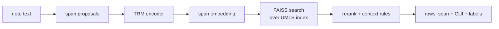
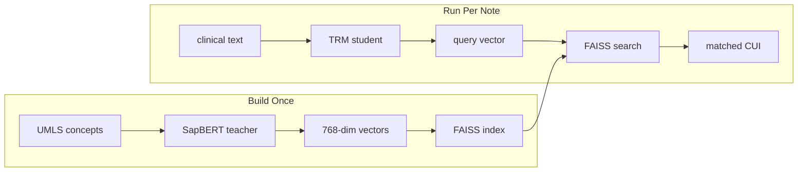
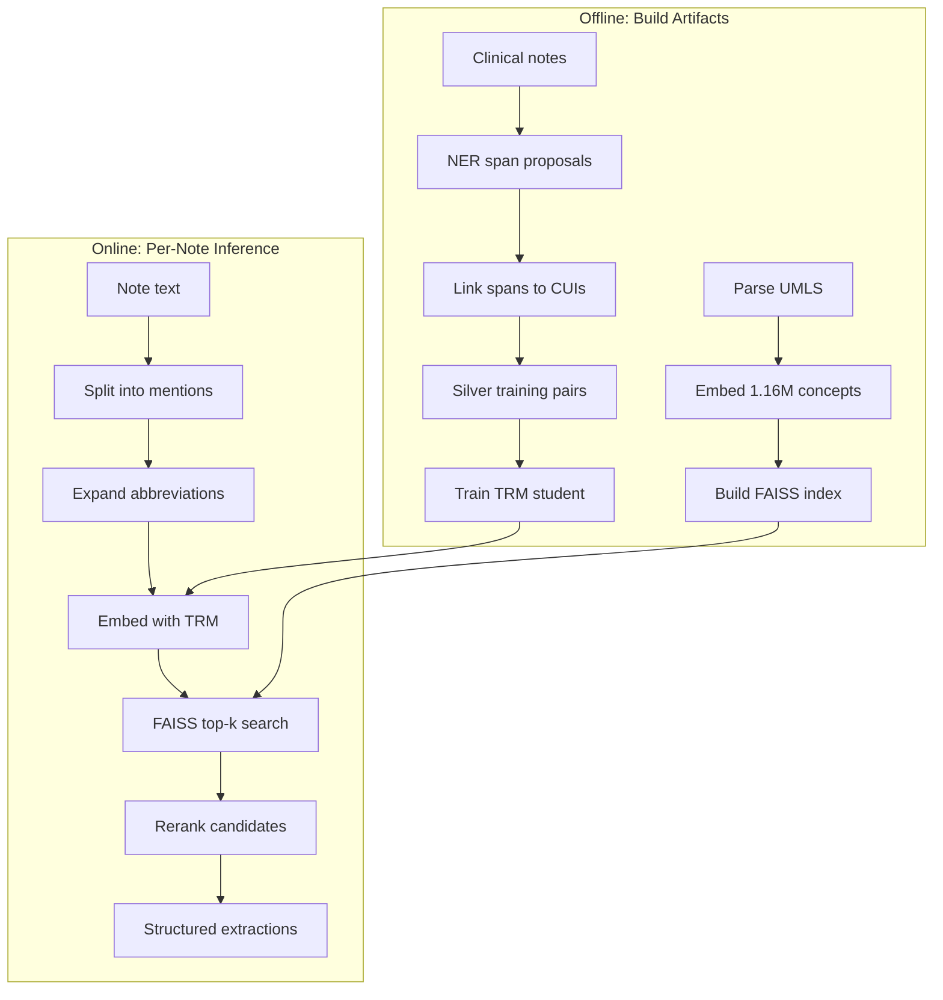
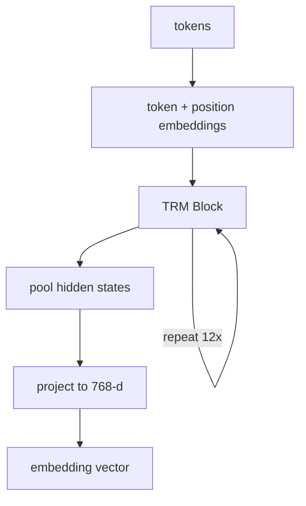
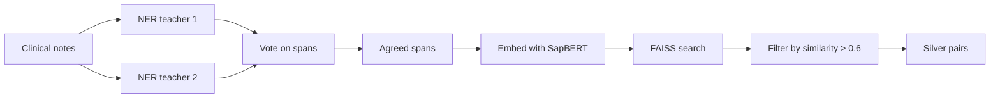
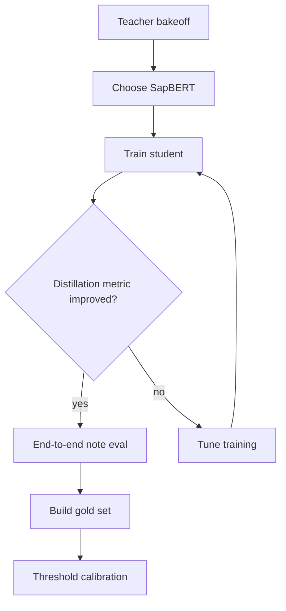

# trm-umls: a small embedding-distilled umls concept linker for clinical text

date: 2026-01-10  
repo: `Medgemma/trm_umls`  
author: Dr Layth M Qassemf  

## abstract

trm-umls is a retrieval-based concept linker for clinical text. It turns short spans in a note (for example "htn", "chest pain", "albuterol") into UMLS concepts and returns a row per mention: the span, its character offsets, the selected CUI, the preferred term, the semantic type (TUI), and light context labels such as whether the mention is present vs absent and patient vs family.

At runtime, the model does not "know" UMLS. It only produces an embedding vector. The CUI comes from nearest-neighbor search in a FAISS index that stores 1,164,238 UMLS concepts embedded in a single teacher space (SapBERT, 768 dimensions). The runtime model is a small TRM encoder (9,864,198 parameters) distilled to match that teacher space so that clinical phrasing and abbreviations land near the right concept vectors.

For review, extractions can be exported to xlsx with score heatmaps and basic color coding by semantic group and assertion. This supports quick clinician spot-checking and threshold tuning, and it helps define what a future gold-standard annotation set should contain.

Suggested citation:

Qassemf, Layth M. *trm-umls: a small embedding-distilled umls concept linker for clinical text*. 2026. Git repository.

```bibtex
@misc{qassemf2026trmumls,
  author = {Qassemf, Layth M.},
  title = {trm-umls: a small embedding-distilled umls concept linker for clinical text},
  year = {2026},
  howpublished = {Git repository},
  note = {Accessed 2026-01-10},
}
```

The diagram below is the whole pipeline in one picture:



---

## 0. motivation and design choices

The goal was a small, fast concept linker that could run on modest hardware while covering the full UMLS concept space. Clinical workflows often require quick turnaround on concept extraction, whether for populating problem lists, flagging billing codes, or feeding downstream analytics. A linker that requires expensive GPU clusters or minutes-per-note processing time does not fit these use cases.

We started by asking whether a large medical language model could be compressed to a few million parameters while retaining its concept-linking ability. The candidate was google/medgemma-4b-it, a multi-billion parameter model trained on medical text.

Aggressive pruning of such models typically destroys the learned representations. Even when the pruned model still runs, it loses the subtle distinctions between similar concepts that clinical use requires. More fundamentally, concept linking is a retrieval problem. The linker must choose from over one million UMLS concepts, each representing a distinct medical idea. Generation-based approaches ("write the correct CUI") are slower, harder to control, and harder to debug than retrieval. Retrieval provides stable candidates and consistent scoring, which makes evaluation tractable.

This mismatch between generative models and retrieval needs led to a pivot. Instead of compressing a generative model, the project builds a small embedder that makes retrieval work well.

One decision shaped the rest of the architecture: pick a single strong biomedical embedding space, embed the entire UMLS concept universe into that space once, and train a small model to project clinical text into the same space.



This creates a clean separation between heavy offline work and fast online inference. Offline, the system parses UMLS, generates concept embeddings, builds the FAISS index, and optionally creates silver training labels from clinical notes. Online, the system embeds a text span, queries FAISS, reranks candidates, and returns the best match. The small model is easy to reason about because it is not itself a concept database. It is an adapter that translates text into coordinates.

Several alternative approaches were explored during development.

The first alternative was using a different embedding teacher. BGE-M3 was evaluated as the teacher space and underperformed SapBERT on the synonym-to-CUI retrieval benchmark in the evaluation section. When the teacher space struggles to distinguish concepts, the student cannot compensate. SapBERT became the standard.

The second alternative was combining multiple embedding spaces at runtime. This is attractive in principle because different models capture different aspects of meaning. However, embedding vectors are only meaningful within their source space. Mixing spaces would require an alignment model, adding complexity and another component to validate.

The third alternative was using a large language model to label spans or choose CUIs directly. The repository structure supports this approach for silver labeling, but the default path keeps the runtime model small and the index as the source of truth.

---

## 1. problem statement

Retrieval solves the "one million concepts" problem, but it forces an output contract. This section defines the row that trm-umls returns for each mention and the constraints that shaped that choice.

The linker takes clinical text as input and produces structured concept extractions. Each extraction includes the mention span with character offsets, the linked UMLS concept with its CUI and preferred term, the semantic type, and context labels for assertion status (present, absent, possible) and subject (patient, family, other).

**Example input:**
```
Patient denies chest pain. History of HTN and DM. Mother had breast cancer.
```

**Example output:**

| span | CUI | preferred term | assertion | subject |
|---|---|---|---|---|
| chest pain | C0008031 | Chest Pain | ABSENT | PATIENT |
| HTN | C0020538 | Hypertensive disease | PRESENT | PATIENT |
| DM | C0011849 | Diabetes Mellitus | PRESENT | PATIENT |
| breast cancer | C0006142 | Malignant neoplasm of breast | PRESENT | FAMILY |

The target workflow is closer to fast dictionary lookup than full clinical NLP. Many clinical applications need quick answers to questions like "what diagnoses are mentioned in this note?" or "does this note mention any medications from this list?" A linker that returns structured concept mentions in under a second per note fits these use cases better than a full parsing pipeline.

Three constraints shaped the development.

First, no gold-standard labeled dataset was available at the start. Clinical notes existed, but a complete human-annotated set of CUI labels for those notes was not built in this iteration. This means the system cannot yet report accuracy metrics in the traditional sense. Building a small gold set is the logical next step and is described in the improvement roadmap.

Second, clinical notes contain protected health information. Any artifact that includes note text, even short context windows around mentions, must be treated as sensitive. This constraint drove decisions about what to commit to the repository and what to remove after experiments.

Third, accuracy is bounded by what UMLS represents. Many clinical modifiers like severity ("severe hypertension"), laterality ("left knee pain"), and temporality ("history of diabetes") are not encoded in a single CUI. The linker extracts these modifiers separately rather than trying to find a single concept that captures them.

Terms used below:

| term | meaning | example |
|---|---|---|
| CUI | concept unique identifier | C0020538 |
| TUI | semantic type identifier | T047 (Disease or Syndrome) |
| preferred term | canonical concept name | "Hypertensive disease" |
| span | exact text substring linked to a CUI | "htn" at chars 27–30 |
| teacher | larger model defining the vector space | SapBERT |
| student | small model trained to match teacher | TRM encoder |
| FAISS | fast nearest-neighbor search index | top-20 candidate CUIs |
| assertion | present vs absent vs possible | "denies chest pain" → ABSENT |
| subject | patient vs family vs other | "mother had breast cancer" → FAMILY |
| silver labels | auto-generated span-to-CUI pairs | not human-verified |

---

## 2. system overview

The architecture separates heavy offline preparation from lightweight online inference. This separation means that expensive operations like embedding millions of concepts happen once, while per-note processing stays fast.

Read the system as two phases. Offline work builds the concept store and the index. Online work runs per note and produces the extracted rows.



The offline phase runs occasionally and produces durable artifacts. It parses UMLS to extract concepts and their synonyms. It embeds each concept using the teacher model. It builds the FAISS index over those embeddings. Optionally, it runs NER teachers over clinical notes to propose spans, links those spans to CUIs, and creates silver training pairs.

The online phase runs frequently. For each note, it splits text into sentence-like chunks, generates mention candidates, expands abbreviations, embeds candidates with the small TRM model, queries FAISS for top candidates, reranks using lexical overlap and clinical biases, and emits structured extractions.

Two different components get called a "teacher" in this project. One proposes spans in raw notes (NER). The other defines the embedding space (SapBERT). Neither runs at inference time.

| teacher role | what it teaches | output | used at inference |
|---|---|---|---|
| span proposal teachers (NER) | where the mention boundaries are in raw notes | spans (start/end + text) | no |
| embedding teacher space (SapBERT) | what "close meaning" looks like in vector space | 768-d vectors | no |

The span proposal teachers are used only to create silver training data. The embedding teacher space is used to build the UMLS index and to define the targets for distillation. Inference uses neither teacher directly. It uses the distilled TRM encoder plus the prebuilt index.

Most of the runtime weight is in the index and its metadata arrays, not in the TRM checkpoint. The main offline artifacts are listed below.

On your machine, the UMLS concept store is written to `trm_umls/data/umls/` after running `trm_umls/scripts/extract_umls.py` against a licensed UMLS release. The key file is `tui_mappings.json`, which maps each CUI to its list of semantic type identifiers. Additional files hold preferred terms and synonyms. These derived UMLS files are not committed to Git for licensing and size reasons.

The teacher embedding index is also built locally. It uses SapBERT with 768-dimensional embeddings and covers 1,164,238 concepts. It is not committed because it is large.

| artifact (local, not committed) | size |
|---|---:|
| full teacher embeddings + index | 6.9 GB |
| UMLS extracted JSON | 631 MB |
| mixed training set | 122 MB |
| model checkpoints | 339 MB |
| abbreviations dictionary (817 entries) | 28 KB |

Runtime memory is dominated by the FAISS index and metadata arrays. The TRM model itself is small at approximately 113 MB on disk.

A clinical walkthrough makes the mechanics concrete. The snippet below is synthetic. It is written in the style of an admission note, but it contains no patient identifiers and is safe to share.

```
Assessment: hypertension, diabetes mellitus, chronic obstructive pulmonary disease. Severe left knee pain.
Denies chest pain or shortness of breath at rest.
```

The pipeline starts by proposing spans. This comes from NER teachers plus a short-span allowlist (for common abbreviations). This step aims for recall. It is acceptable to include extra spans because later steps filter and score them.

In this example, the candidates include:
- hypertension
- diabetes mellitus
- chronic obstructive pulmonary disease
- severe left knee pain
- chest pain
- shortness of breath at rest

If the note had used abbreviations, the expansion dictionary would convert them before lookup:
- HTN → hypertension
- DM → diabetes mellitus
- COPD → chronic obstructive pulmonary disease
- CP → chest pain
- SOB → shortness of breath

Next, the pipeline normalizes spans for lookup. Many modifiers that clinicians care about are not encoded in a single CUI. To reduce noise in retrieval, trm-umls extracts a few simple modifiers and strips them from the text used for embedding.

| raw span | normalized text (embedded) | severity | laterality | temporality |
|---|---|---|---|---|
| severe left knee pain | knee pain | severe | left |  |
| chronic obstructive pulmonary disease | obstructive pulmonary disease |  |  | chronic |

The normalized text is what TRM embeds and what FAISS uses for retrieval. The modifiers stay attached to the mention as separate fields.

Finally, TRM produces a 768-dimensional vector for each normalized span. FAISS retrieves the nearest UMLS concept vectors and returns the best candidate after reranking and context rules (negation, subject hints). The score is cosine similarity in the teacher space, and the threshold controls how often the system abstains.

The table below shows the actual output from the current checkpoint (`trm_umls/checkpoints/model.pt`, epoch 10) at `threshold=0.55` with clinical reranking enabled.

| span | cui | preferred term | score | assertion | modifiers |
|---|---|---|---:|---|---|
| hypertension | C3280772 | Hypertension (variable) | 0.722 | PRESENT |  |
| diabetes mellitus | C0011849 | Diabetes Mellitus | 0.684 | PRESENT |  |
| chronic obstructive pulmonary disease | C0155883 | Chronic obstructive asthma (with obstructive pulmonary disease) | 0.654 | PRESENT | temporality=chronic |
| severe left knee pain | C0231749 | Knee pain | 0.733 | PRESENT | severity=severe, laterality=left |
| chest pain | C0008031 | Chest Pain | 0.691 | ABSENT |  |
| shortness of breath at rest | C4534568 | Shortness of breath or trouble breathing when sitting at rest | 0.623 | ABSENT |  |

Two things matter in practice.

Assertion matters as much as the CUI. "Denies chest pain" and "denies shortness of breath" should not populate a problem list, even though the underlying concepts are detected.

Disambiguation is the other half of the job. UMLS contains many closely related concepts, and "hypertension" can legitimately map to multiple nearby entries. When the top candidates are near-ties, trm-umls uses reranking (section 6) to prefer more clinically typical choices, and it is also why a small gold set is still needed (see improvement roadmap).

Clinical notes contain many text fragments that look like medical terms but are not. Section headers like "ASSESSMENT" or "PLAN" would match concepts if embedded directly. Table fragments, field labels, and placeholder text would generate false positives. For that reason, trm-umls applies conservative precision filters before embedding:

The pipeline includes conservative filters applied before embedding:

| filter | catches | example |
|---|---|---|
| header stoplist | section headers | "Assessment:", "Plan:", "Labs:" |
| min length + allowlist | short junk, keeps abbrevs | allows "HTN" but blocks "a" |
| scaffold detection | table fragments | "___", "[ ]", field labels |
| stop-mention list | non-clinical terms | "unknown", "n/a", "pending" |

These filters are not the final word on precision. They exist to keep the retrieval model focused on plausible medical mentions.

---

## 3. models and indexing

With the embedding space fixed, the index becomes the single source of truth for concept lookup. Everything downstream depends on the quality of that space.

At inference time, two artifacts do almost all the work: the TRM encoder produces vectors, and FAISS retrieves the nearest concepts. The rest of the system is bookkeeping around spans, filtering, and context labels.

**the embedding space concept.** Think of the embedding space as a 768-dimensional room where every medical concept has a location. Concepts with similar meanings sit near each other. "Hypertension", "high blood pressure", and "elevated BP" all cluster together, while "hypotension" sits in a different region.

```
                    ┌─────────────────────────────────────┐
                    │        768-dimensional space        │
                    │                                     │
                    │    [hypertension] ·                 │
                    │    [high blood pressure] ·          │
                    │    [elevated BP] ·                  │
                    │                                     │
                    │                    · [hypotension]  │
                    │                    · [low BP]       │
                    │                                     │
                    │  · [diabetes]                       │
                    │  · [DM]                             │
                    │  · [diabetes mellitus]              │
                    └─────────────────────────────────────┘
```

When a new text span arrives, the student model projects it into this same space. The nearest concept becomes the predicted link. If a clinician writes "HTN" in a note, the student projects it near the "hypertension" cluster, and FAISS returns C0020538.

**teacher model.** The teacher model defines the coordinate system for all downstream operations. We tested two candidates on a controlled retrieval task:

| teacher model | hit@1 | hit@5 | MRR |
|---|---:|---:|---:|
| SapBERT (CLS pooling) | 0.9537 | 0.9751 | 0.9625 |
| BGE-M3 (dense) | 0.8853 | 0.9259 | 0.9016 |

SapBERT placed the correct CUI at rank 1 for 95.4% of queries. This means when you embed "elevated blood pressure" and search for the nearest concept, you get "hypertensive disease" as the top result 95% of the time. That accuracy ceiling bounds everything the student can achieve.

The pipeline standardizes on `cambridgeltl/SapBERT-from-PubMedBERT-fulltext` with 768-dimensional output.

**student encoder.** The student model is intentionally small. The checkpoint contains 9,864,198 parameters compared to SapBERT's 110 million. This 10x reduction in size comes with minimal accuracy loss because the student only needs to *project* into the existing space, not *define* it.

| parameter | value |
|---|---|
| total parameters | 9,864,198 |
| hidden size | 256 |
| layers | 2 |
| attention heads | 4 |
| output dimension | 768 (matches teacher) |
| max sequence length | 64 tokens |

The architecture uses recursive computation. The same transformer block applies multiple times per input (3 high-level cycles × 4 low-level cycles = 12 effective passes), increasing depth without adding parameters.

If you are not used to the term "recursive model", the simplest way to read this is: the encoder reuses the same small set of weights several times. Instead of 12 separate layers with 12 separate parameter sets, it runs one layer repeatedly. That keeps the model small while still allowing multiple rounds of attention and refinement.



Two optional classification heads predict assertion (PRESENT/ABSENT/POSSIBLE) and subject (PATIENT/FAMILY/OTHER).

**FAISS index.** Concept vectors are stored in a FAISS IVF index for fast approximate nearest-neighbor search. With 1.16 million concepts, exact search would be slow. The IVF index partitions the space into 2048 clusters and searches only the 32 most relevant clusters at query time.

| index parameter | value |
|---|---:|
| vectors | 1,164,238 |
| dimensions | 768 |
| clusters (nlist) | 2048 |
| clusters searched (nprobe) | 32 |

This trades a small amount of accuracy for significant speed. In practice, if the correct concept ranks #1 with exact search, it still ranks #1 with IVF search in nearly all cases. The few edge cases where ranking differs are handled by reranking.

---

## 4. training objective

The student model learns to map text spans into the teacher embedding space. When a span embeds close to its correct concept vector, FAISS retrieval succeeds.

In plain terms, training teaches the small model to place clinical phrasing in the same neighborhood as the right UMLS concept vectors.

**contrastive loss.** Training uses a contrastive loss that teaches the model to distinguish the correct concept from distractors. Given a batch of 64 span-concept pairs, the model learns that span #1 should be closest to concept #1, span #2 closest to concept #2, and so on.

The loss function computes cosine similarity between each span embedding and all concept embeddings in the batch:

$$
\text{similarity}(s_i, c_j) = \frac{s_i \cdot c_j}{\|s_i\| \cdot \|c_j\|}
$$

For span $s_i$ with correct concept $c_i$, the loss pushes $\text{similarity}(s_i, c_i)$ high while pushing $\text{similarity}(s_i, c_j)$ low for $j \neq i$.

For a concrete example, suppose a batch contains:
- span: "high blood pressure" → concept: C0020538 (Hypertensive disease)
- span: "type 2 diabetes" → concept: C0011860 (Type 2 DM)
- span: "chest discomfort" → concept: C0232289 (Chest discomfort)

The model learns:
- "high blood pressure" embedding → close to C0020538 vector
- "high blood pressure" embedding → far from C0011860 and C0232289 vectors

Temperature scaling ($\tau = 0.07$) sharpens the distribution, making the model more confident about correct matches.

**silver label pipeline.** Gold labels from human annotators were not available. To train on clinical text, the system generates silver labels automatically.



The pipeline uses multiple NER models that vote on span proposals. Spans that multiple teachers agree on receive higher confidence. Each span embeds in the teacher space and queries FAISS. Candidates are filtered by minimum similarity (0.60) and minimum lexical overlap (0.10).

The training set mixes 1 million UMLS synonym pairs with 34,000 silver pairs from notes. The UMLS pairs anchor the embedding space with clean data, while the silver pairs teach the model to handle real clinical language.

**assertion and subject heads.** Two small classification heads provide light context labels.

**Assertion head** classifies spans as:
- PRESENT: "Patient has hypertension"
- ABSENT: "Patient denies chest pain"  
- POSSIBLE: "Possible pneumonia"

**Subject head** classifies spans as:
- PATIENT: "History of DM"
- FAMILY: "Mother had breast cancer"
- OTHER: "Donor was CMV positive"

The heads are trained on a small labeled set. The checkpoint reports perfect accuracy on held-out data, but this reflects fit to a tiny objective, not clinical-grade negation detection. The pipeline supplements these heads with rule-based overrides for common patterns like "denies" and "family history of".

---

## 5. evaluation

Evaluation proceeds in layers. Early tests check whether the embedding space behaves correctly in isolation. Later tests check what the full pipeline does on clinical-like text.

The order matters. If the teacher embedding space cannot retrieve the right CUI for a synonym, the student will not fix that. If the student does not match the teacher on held-out pairs, end-to-end behavior tends to be unstable.



**teacher bakeoff.** Before training the student, the teacher space must be validated. The bakeoff sampled 20,000 concepts from UMLS and 20,000 synonym queries. Each query is a synonym text, and the target is the correct CUI from that restricted universe.

| teacher model | hit@1 | hit@5 | MRR |
|---|---:|---:|---:|
| SapBERT (CLS pooling) | 0.9537 | 0.9751 | 0.9625 |
| BGE-M3 (dense) | 0.8853 | 0.9259 | 0.9016 |

SapBERT placed the correct CUI at rank 1 for 95.4% of queries and in the top 5 for 97.5%. When you embed the synonym "high blood pressure" and search the index, the concept "Hypertensive disease" (C0020538) appears at rank 1 nineteen times out of twenty. That hit rate sets the ceiling for the student model.

**distillation metric.** The distillation metric measures how well the student matches teacher embeddings. Mean cosine similarity between student predictions and teacher targets on a held-out set provides the primary signal.

$$
\text{mean\_sim} = \frac{1}{N} \sum_{i=1}^{N} \frac{f(x_i) \cdot t(y_i)}{\|f(x_i)\| \cdot \|t(y_i)\|}
$$

where $f(x_i)$ is the student's embedding for span $x_i$ and $t(y_i)$ is the teacher's embedding for concept $y_i$.

| checkpoint | epoch | mean similarity | interpretation |
|---|---:|---:|---|
| baseline | 4 | 0.4983 | student vectors point roughly in the right direction |
| latest | 10 | 0.7062 | student vectors closely align with teacher |

Mean similarity improved from 0.50 to 0.71 between epochs 4 and 10. This is the clearest signal that training is working. When this metric stalls, downstream retrieval rarely improves.

Clinically, a similarity of 0.71 means the student's embedding for "chest pain" points in nearly the same direction as SapBERT's embedding for the "Chest Pain" concept. When you search FAISS, the correct concept consistently appears in the top results.

**end-to-end note evaluation.** End-to-end evaluation measures what the full pipeline produces on real clinical text. The test set was 200 admission notes processed with the full FAISS index. A fixed threshold of 0.55 filtered low-confidence extractions.

| run | extracted rows | notes with extractions | mean score |
|---|---:|---:|---:|
| baseline (epoch 4) | 2,731 | 147/200 | 0.5773 |
| latest (epoch 10) | 10,331 | 181/200 | 0.6493 |

The latest checkpoint extracted nearly four times as many concept mentions. Coverage improved from 147 to 181 notes with at least one extraction. Mean similarity scores rose from 0.58 to 0.65.

These are behavior metrics, not accuracy metrics. Higher row counts indicate stronger embedding signal. The model is more confident about more spans. Without a gold set, we cannot distinguish true positives from false positives. The increase from 2,731 to 10,331 rows means the improved model finds medical concepts where the baseline missed them, but it may also find false positives where the baseline correctly abstained.

**runtime profile.** Runtime was measured on a synthetic 200-line note using an NVIDIA RTX 3070.

| step | time |
|---|---:|
| load model + index (cold start) | 32.46 s |
| extract 200-line note | 3.19 s |
| rows extracted | 412 |
| throughput | 129 rows/s |

Cold start cost is dominated by index loading. Once loaded, throughput scales with the number of mention candidates. For a service deployment, the index loads once at startup and amortizes across many requests.

---

## 6. linking and reranking

FAISS retrieval returns raw similarity scores. Reranking adjusts these scores based on additional signals that improve clinical accuracy.

This is where many clinician-facing preferences live. When multiple CUIs are near-ties in embedding space, reranking can prefer disease concepts over measurement variables, prefer common clinical semantic groups, and penalize overly specific variants.

**the reranking problem.** Consider the span "HTN" from a note. After abbreviation expansion to "hypertension" and embedding, FAISS returns these candidates:

| rank | CUI | preferred term | similarity |
|---:|---|---|---:|
| 1 | C0020538 | Hypertensive disease | 0.89 |
| 2 | C0235222 | Hypertensive heart disease | 0.87 |
| 3 | C0020545 | Hypertension, Portal | 0.85 |
| 4 | C0020543 | Hypertension, Pulmonary | 0.84 |

All four are hypertension-related concepts. The embedding similarity alone cannot distinguish which one the clinician intended. Reranking uses additional signals.

**rerank score formula.** The final score combines embedding similarity with lexical overlap and a few lightweight tie-breakers:

$$
\text{score}_i = \text{sim}_i + w_{\text{lex}} \cdot \text{lex}_i + w_{\text{rel}} \cdot \text{rel}_i + b_{\text{group}} + b_{\text{tui}} + p_i
$$

| term | meaning | example |
|---|---|---|
| $\text{sim}_i$ | cosine similarity from FAISS | 0.89 |
| $\text{lex}_i$ | token overlap (Jaccard) | "hypertension" vs "Hypertensive disease" = 0.33 |
| $\text{rel}_i$ | UMLS relation hits in local context (optional) | 2 neighbors shared |
| $b_{\text{group}}$ | semantic group bias | Disorders: +0.01 |
| $b_{\text{tui}}$ | semantic type bias | T047 Disease: +0.008 |
| $p_i$ | penalties | CTCAE variant: -0.02 |

For span "hypertension" and preferred term "Hypertensive disease":
- Span tokens: {"hypertension"}
- Term tokens: {"hypertensive", "disease"}
- Intersection: {} (no exact matches after normalization)
- Jaccard = 0 / 3 = 0

For span "diabetes mellitus" and preferred term "Diabetes Mellitus":
- Span tokens: {"diabetes", "mellitus"}
- Term tokens: {"diabetes", "mellitus"}
- Intersection: {"diabetes", "mellitus"}
- Jaccard = 2 / 2 = 1.0

Higher lexical overlap boosts confidence that the match is correct.

Relation hits are optional. If MRREL edges are available and relation reranking is enabled, the pipeline counts how often each candidate is related to other concepts already chosen in the same sentence. Candidates that fit the local context get a small boost. This is a tie-breaker, not a second model.

**rerank margin.** Reranking only allows switching within a margin. If rank #1 has similarity 0.89 and rank #2 has 0.70, reranking will not swap them regardless of lexical overlap. The margin parameter (default 0.04) controls this behavior.

$$
\text{allow rerank if: } \text{sim}_i \geq \max_j(\text{sim}_j) - 0.04
$$

This prevents lexical overlap from overriding a clearly better embedding match. In the HTN example above, all four candidates are within margin (0.89 - 0.84 = 0.05, just above margin), so reranking can adjust the order.

**clinical biases.** Clinical notes mostly discuss diseases, symptoms, procedures, and medications rather than abstract concepts. Small biases push clinical categories forward:

| semantic group | bias |
|---|---:|
| Disorders (diseases, syndromes) | +0.010 |
| Procedures | +0.006 |
| Chemicals/Drugs | +0.004 |
| Anatomy | +0.002 |
| Concepts (abstract) | -0.010 |

These biases are small enough that a high-similarity match from any category still wins. They act as tie-breakers when similarity scores are close.

---

## 7. running the system

**installation**

```bash
cd trm_umls
pip install -r requirements.txt
```

Required artifacts (local, not committed):
- `trm_umls/checkpoints/model.pt`
- `trm_umls/data/embeddings/umls_flat.index`
- `trm_umls/data/embeddings/embedding_metadata.json`
- `trm_umls/data/umls/tui_mappings.json`

**basic usage**

**Smoke test:**
```bash
python3 trm_umls/pipeline.py --smoke
```

**Process text:**
```bash
python3 trm_umls/pipeline.py --text "Patient denies HTN. Family history of DM."
```

**JSON output:**
```bash
python3 trm_umls/pipeline.py --text "Patient denies HTN." --json
```

**web ui (highlighted spans + filtering)**

Start the local api (loads the model + index once):
```bash
python3 -m trm_umls.api
```

In a second terminal, start the vite ui:
```bash
cd ui
npm install
npm run dev
```

Open `http://localhost:5173`. The ui sends note text to the local api only.

**Batch a notes directory + export to xlsx (review workflow):**
```bash
python3 trm_umls/scripts/eval_notes_dir.py \
  --notes-dir path/to/notes \
  --limit-files 10 \
  --output-jsonl trm_umls/runs/sample_eval.jsonl \
  --checkpoint trm_umls/checkpoints/model.pt \
  --device cuda \
  --threshold 0.55 \
  --clinical-rerank \
  --dedupe

python3 trm_umls/scripts/export_eval_jsonl_to_xlsx.py \
  --eval-jsonl trm_umls/runs/sample_eval.jsonl \
  --output-xlsx trm_umls/runs/sample_eval.xlsx \
  --no-context
```

**key parameters**

| flag | default | effect |
|---|---:|---|
| `--threshold` | 0.55 | minimum similarity to keep extraction |
| `--top-k` | 10 | FAISS candidates per span |
| `--clinical-rerank` | off | enable semantic biases |
| `--no-dedupe` | off | keep duplicate mentions |

**programmatic use**

```python
from trm_umls.pipeline import TRMUMLSPipeline

# Load once at startup
pipe = TRMUMLSPipeline.load("trm_umls/checkpoints/model.pt")

# Process multiple notes
for note in notes:
    extractions = pipe.extract(
        note.text,
        threshold=0.55,
        clinical_rerank=True
    )
    for ext in extractions:
        print(f"{ext.text} -> {ext.cui} ({ext.preferred_term})")
```

---

## 8. comparison with cTAKES

cTAKES is a mature clinical NLP system developed at Mayo Clinic. It represents a different architectural approach to concept linking.

| aspect | cTAKES | trm-umls |
|---|---|---|
| matching | rule-based dictionary | embedding retrieval |
| runtime | Java/UIMA | Python/PyTorch/FAISS |
| negation | full scope parsing | light head + rules |
| synonym coverage | explicit synonym lists | learned similarity |

**Strengths of embedding retrieval:**

Embedding retrieval matches synonym variants that string matching misses. "HTN", "hypertension", "high blood pressure", and "elevated BP" all cluster together in embedding space without explicit synonym lists. The Python stack is simpler to deploy than UIMA.

**Strengths of cTAKES:**

cTAKES has more complete negation and subject handling. Its sectioning logic understands clinical note structure. Years of rule refinement handle edge cases that a new system has not encountered.

---

## 9. known limitations

**failure patterns**

| pattern | example | cause |
|---|---|---|
| template leakage | "ASSESSMENT" matches a concept | header filter missed it |
| over-specific CUI | "hypertension" → CTCAE variant | preferred term penalty too weak |
| abbreviation collision | "BUN" → wrong meaning | multiple valid expansions |
| negation scope | "no HTN, DM, or CAD" | only first item negated |
| multi-mention split | "DM and HTN" → only one extracted | splitting failed |

**what accuracy means without gold labels**

The evaluation numbers earlier in this document are behavior metrics, not accuracy metrics. When the model extracts 10,331 rows instead of 2,731, we know it is finding more concepts, but we do not know what fraction are correct. A gold set is required to measure precision and recall.

---

## 10. improvement roadmap

**gold set (highest priority)**

Target: 50-200 labeled spans across note types. Track strict CUI accuracy, per-semantic-group accuracy, and false positive categories. Once this exists, all other tuning becomes measurable.

**threshold calibration**

Sweep thresholds from 0.45 to 0.80 on a gold set. Plot precision versus recall. This typically yields two operating points: a high-precision threshold for automation and a review threshold for human-in-the-loop workflows.

**hard negatives**

Hard negatives help the model distinguish near-miss concepts. Train with examples where "hypertension" must be distinguished from "hypotension" and "pulmonary hypertension" from "systemic hypertension".

---

## appendix a: reproducibility commands

**Run inference:**
```bash
python3 trm_umls/pipeline.py --smoke
python3 trm_umls/pipeline.py --text "Patient denies HTN." --json
```

**Rebuild FAISS index:**
```bash
python3 trm_umls/scripts/build_faiss_index.py \
  --embeddings trm_umls/data/embeddings_sapbert_full/umls_embeddings.npy \
  --output trm_umls/data/embeddings_sapbert_full \
  --index-type ivf --nlist 2048 --nprobe 32 --train-sample 200000
```

**Train new checkpoint:**
```bash
python3 trm_umls/train_multitask.py \
  --embedding-dir trm_umls/data/embeddings_train \
  --checkpoint-dir trm_umls/checkpoints \
  --epochs 10 --batch-size 64 --max-length 64
```

---

## appendix b: data handling

Clinical notes and derived artifacts require careful handling.

- Do not commit clinical notes or files containing context windows
- Treat any JSONL file in `trm_umls/runs/` as sensitive
- Prefer storing only note identifiers, offsets, CUIs, and scores
- When sharing errors for debugging, use synthetic text or redact spans

---

## references

[1] Liu, F., et al. Self-alignment pretraining for biomedical entity representations. arXiv:2010.11784.

[2] Savova, G.K., et al. Mayo clinical text analysis and knowledge extraction system (cTAKES). JAMIA 2010.

[3] National Library of Medicine. Unified Medical Language System (UMLS). Release 2025AA.
