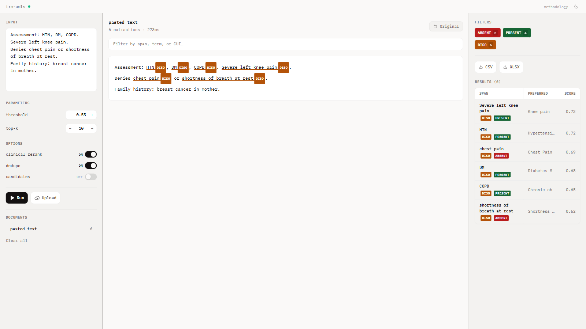
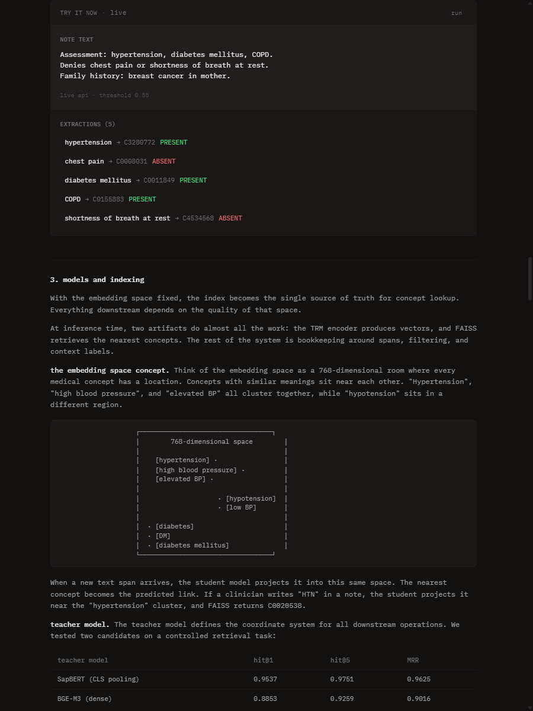

# trm-umls ui

A local viewer for clinical concept extraction with entity highlighting and filtering.

## Features

- **Three-pane layout**: Input controls | Document with entity highlighting | Results table
- **Entity highlighting**: Underline-style highlighting with inline semantic group badges
- **Original ↔ Preferred toggle**: Switch between raw spans and standardized UMLS terminology
- **Filters**: Filter by assertion (PRESENT/ABSENT/POSSIBLE) and semantic group (DISO, CHEM, etc.)
- **Dark/Light themes**: Warm `#131010` dark mode and cream light mode
- **Methodology page**: Interactive article explaining the pipeline (`#methodology`)

## Screenshots

### Dark Mode (Extractor)


### Light Mode (Extractor)  


### Methodology Page


## Run

Start the api (loads model + index once):

```bash
cd /path/to/Medgemma
python3 -m trm_umls.api
```

Start the ui:

```bash
cd ui
bun install
bun run dev
```

Open `http://localhost:5173`.

## Pages

| Path | Description |
|------|-------------|
| `/` | Concept extractor - paste clinical text, view entity extractions |
| `/#methodology` | Interactive article explaining how trm-umls works |

## Config

By default the ui calls `http://127.0.0.1:8000`.

Override with:

```bash
VITE_API_BASE=http://127.0.0.1:8000 bun run dev
```

## Design

The UI follows OpenCode-inspired design principles:
- Warm backgrounds (`#131010` dark, `#faf9f8` light)
- Monochrome accents (no bright colors in UI chrome)
- Squarish corners (4px border radius)
- Color reserved for data visualization only

## Privacy

This runs locally only. Do not point it at a remote api if your notes contain PHI.
